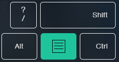

# **CLICK** to move. Holding arrows will cause mouse drifting
- Mouse Keys for people who don't have a numpad. 
- Run with `pythonw` to hide cmd window
## **Usage**:
| Key | Action | notes |
|---|---| --- |
| **END PROGRAM** | **right control** + **ESC** ||
| **right shift** + **right control** <br>  | **Left click** | Hold shift **and then click control** <br> ctrl + shift is shortcut to change input language in Windows|
| **menu** <br>  | **Right click** ||
| clicking arrows | moving cursor ||
| hold **right shift** while moving | **shorter** cursor movement distance ||
| hold **right control** while moving | **longer** cursor movement distance ||
    
## **Installation**
- Clone repo and install dependencies:
    - [PyAutoGUI](https://pyautogui.readthedocs.io/en/latest/)
        ```
        pip install pyautogui
        ```
    - [pynput](https://pynput.readthedocs.io/en/latest/)
        ```
        pip install pynput
        ```
- Download standalone .exe file from [releases](https://github.com/skidraw400/Python-MouseKeys/releases/latest) (for Windows)